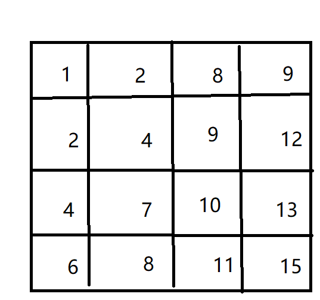
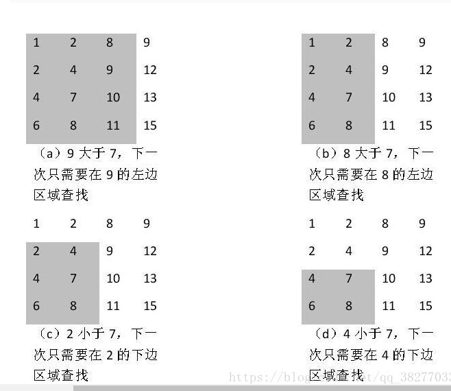
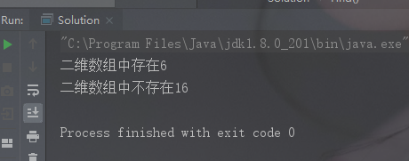

###  二维数组的查找

*问题描述*

>   在一个二维数组中（每个一维数组的长度相同），每一行都按照从左到右递增的顺序排列，每一列都按照从上到下递增的顺序排列，请完成一个函数，输入这样的一个二维数组和一个整数,判断该数组中是否含有该数组

代码片段：

```java
public class Solution {
    public boolean Find(int target, int [][] array) {

    }
}
```

图形描述：



> 思路：选取右上角元素
>
> 如果右上角元素大于查找目标元素，则在该列以左查找元素
>
> 如果右上角元素小于目标查找元素，则在该行以下查找元素

过程图示：


```java
package com.winki.test;

/**
 * @Author WinkiLee
 * @Date 2019/4/28 17:14
 * @Description
 */
public class Solution {


    public static boolean Find(int target,int[][] array){

        int row_len=array.length;
        int column_len=array[0].length;
        int row;
        int column;

        for (row=0,column=column_len-1;column>=0&&row<row_len;){
            //column>=0&&row<row_len;是为了防止行列值越界
            if (target==array[row][column]){
                return true;
            }
            if (array[row][column]>target){
                column--;
                continue;
            }
            if (array[row][column]<target){
                row++;
                continue;
            }
        }
        return false;
    }


    public static void main(String[] args) {
        int[][] arr = { {1,2,8,9}, {2,4,9,12},{4,7,10,13},{6,8,11,15}};
        if (Find(6,arr)==true){
            System.out.println("二维数组中存在6");
        }else {
            System.out.println("二维数组中不存在6");
        }
        if (Find(16,arr)==true){
            System.out.println("二维数组中存在16");
        }else {
            System.out.println("二维数组中不存在16");
        }
    }
}

```

运行结果：

